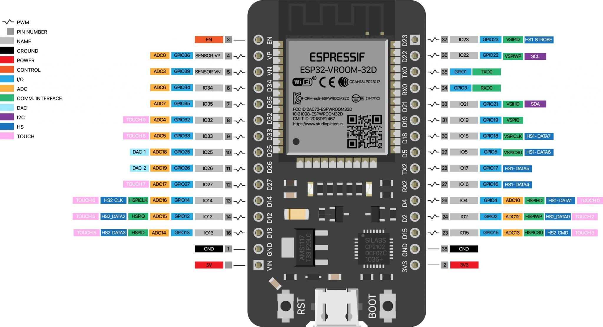
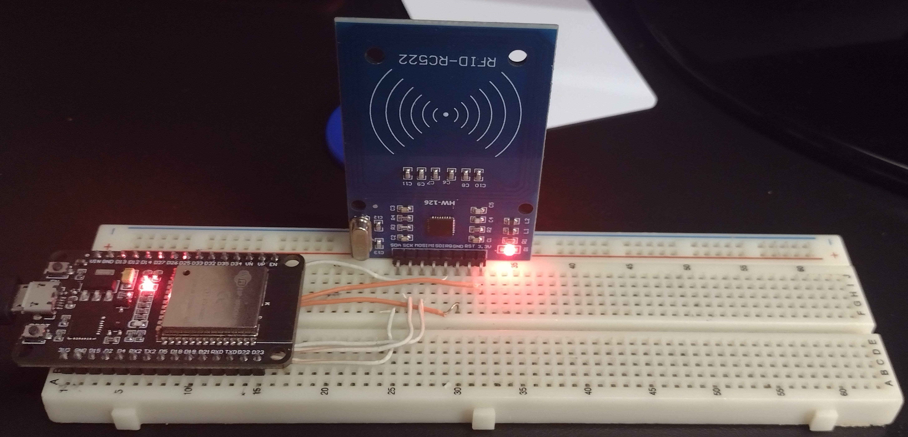
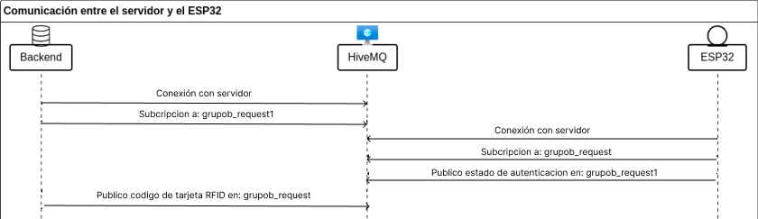

## Lector RFID con conexión mediante Wi-Fi y protocolo MQTT.

En este proyecto tenemos un lector de tarjetas RFID que publica las tarjetas leídas en un cierto tópico. Un servicio Backend recibe esa publicación, verifica que el código RFID pertenezca a un usuario autorizado y publica una respuesta.
## Documentacion
Este proyecto se documentó utilizando Doxygen, una herramienta para generar documentación automática a partir de comentarios integrados en el código fuente.

[Documentación de Doxygen](https://facumruiz.github.io/ESP-RC522/files.html)

## Estructura del proyecto
```
ESP-RC522/
│
├── Documentacion/
│
├── imgs/
│   ├── circuito.jpg
│   ├── diagrama.jpg
│   └── esp32_pinout.jpg
│
├── main/
│   ├── include/
│   │    ├── base.h/
│   │    ├── guards.h/
│   │    ├── mqtt.h/
│   │    ├── rc522_registers.h/
│   │    ├── rc522.h/
│   │    ├── wifi_credentials.h/
│   │    └── wifi.h/
│   │ 
│   ├── main.c
│   ├── mqtt.c
│   ├── rc522.c
│   └── wifi.c/
│ 
├── .gitignore
├── CMakeLists.txt
└── README.md
```
### Observaciones
- **Librerías en `include/`:** Aquí se encuentran los archivos de encabezado que contienen las definiciones de las funciones y estructuras utilizadas en el proyecto.
## Configuración

El archivo `config.h` define las siguientes configuraciones:

#### Pines GPIO

- **LED interno del ESP**: GPIO 2
- **Lector RFID RC522**:
  - MISO: GPIO 25
  - MOSI: GPIO 23
  - SCK: GPIO 19
  - SDA: GPIO 22

#### Configuración MQTT

- **URL del broker MQTT**: `mqtt://broker.hivemq.com`
- **Temas MQTT**:
  - `grupob_request`: Publicación de información de tarjetas RFID
  - `grupob_request1`: Suscripción a comandos de control

#### Configuración Wi-Fi
- **Credenciales Wi-Fi:** Almacena tu SSID y contraseña de Wi-Fi en `wifi_credentials.h` dentro de include.
```c
#ifndef _WIFICREDENTIALS_H
#define _WIFI_CREDENTIALS_H

#define WIFI_CREDENTIALS_ID    ("name")
#define WIFI_CREDENTIALS_PASS  ("password")

#endif
```
La placa utilizada para realizar las pruebas tiene la siguiente distribución de pines. Imagen extraída de la tienda donde se compro el modelo del ESP32


[Link a tienda](https://tienda.starware.com.ar/producto/placa-desarrollo-espressif-esp32-ch9102x-dual-core-wifi-bluetooth/)


Revisar que su placa de desarrollo coincida con el siguiente pinout.


### Imagen del circuito montado




### Funcionamiento.


### Diagrama de funcionamiento del dispositivo.




### Manejo de Eventos
- **Tarjeta RFID Escaneada:** Utilizando un lector RFID RC522, el sistema escanea tarjetas RFID cercanas. Cuando se detecta una tarjeta, se genera un evento que se maneja para obtener y publicar la información de la tarjeta mediante MQTT.
- **Datos Recibidos por MQTT:** El sistema se conecta a un broker MQTT utilizando una URL predefinida. Al recibir mensajes desde MQTT, el sistema los procesa para controlar el estado del LED. Por ejemplo, encendiendo o apagando el LED según el mensaje recibido.

Para más detalles sobre la configuración y uso, el archivo generado por Doxygen disponible en [enlace de la documentación](https://facumruiz.github.io/ESP-RC522/files.html)


